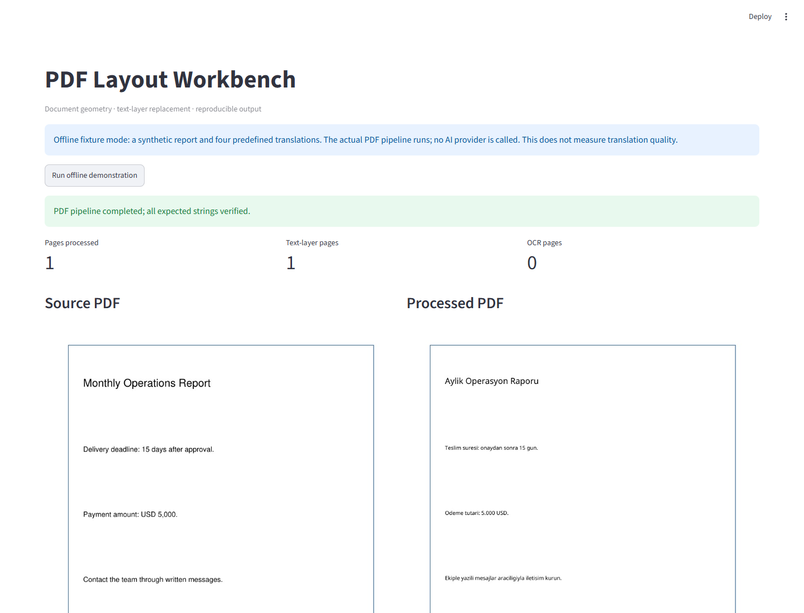
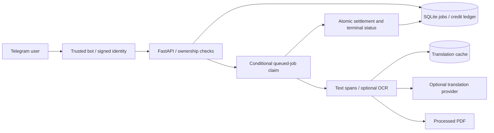

# PDF Layout Workbench

A Python PDF processing service with a Telegram adapter, configurable translation/OCR providers, layout replacement, authenticated job access and a durable SQLite credit ledger.



## Engineering scope

- Text-layer PDFs: extract text spans, preserve geometry and style where possible, translate and replace text.
- Scanned pages: optional provider OCR and translation; this path needs credentials and separate quality evaluation.
- Translation cache and bounded provider retries/timeouts.
- Jobs with page progress, conditional worker claiming and atomic terminal status / credit settlement.
- Signed user identities, job ownership checks and admin-only credit grants.
- Explicit offline recovery of interrupted workers.

This is a portfolio implementation. No customer usage, AI quality rate, hosting reliability or payment integration success is claimed. Credit grants are manual; Stars payment verification is not an implemented automatic payment integration.

## Try the offline demonstration

Python 3.10+:

```bash
python -m venv .venv
# Linux/macOS: source .venv/bin/activate
# PowerShell: .venv\Scripts\Activate.ps1
python -m pip install -e ".[dev,demo]"
python scripts/demo_offline.py
python -m streamlit run demo_app.py
```

The demonstration creates a one-page synthetic English report and uses four predefined ASCII Turkish translations. It executes the **actual PDF layout pipeline**, asserts every expected translated string and writes source/processed PDFs, PNGs and `output/demo/run.json`. The UI button repeats that process and offers downloads. No provider is contacted. This demonstrates layout processing, not AI translation quality or OCR accuracy. The recorded run processed one text-layer page and zero OCR pages.

## Service configuration

Copy `.env.example` to an untracked `.env`. Set `USER_AUTH_SECRET` to a cryptographically random value of at least 32 characters in both the API and trusted bot environments. Generate locally:

```bash
python -c "import secrets; print(secrets.token_urlsafe(32))"
```

Do not commit the generated value or distribute it to public/browser clients. Set a separate `ADMIN_API_TOKEN`. Provider operation additionally requires `MODEL_PROVIDER` and the corresponding provider credentials/models in `.env.example`; no live provider test is required for the offline demo.

```bash
python scripts/init_db.py
python -m uvicorn pdf_translator.api.main:app --host 127.0.0.1 --port 8900
```

The Telegram adapter signs `update.effective_user.id` and sends `X-User-Token` to the API. Tokens use HMAC-SHA256, expire after an hour and are issued only by trusted server-side code. Form/query/path user IDs must match the signed identity. Job metadata and downloads require ownership. Missing secret configuration returns 503; invalid/expired tokens return 401. There is no public signing endpoint.

Hosted operation requires HTTPS. Tokens remain replayable until expiry; individual revocation and browser login are not implemented. Secret rotation requires updating both services. The offline UI does not expose authentication secrets or exercise Telegram/payment flows.

## API

| Endpoint | Access |
| --- | --- |
| `GET /health`, `/version` | Public service metadata |
| `POST /v1/jobs` | Signed user; multipart PDF/languages/user ID |
| `GET /v1/jobs/{job_id}` | Signed owner |
| `GET /v1/jobs/{job_id}/download?telegram_user_id=...` | Signed owner |
| `GET /v1/credits/{telegram_user_id}` | Signed matching user |
| `POST /v1/admin/credits/grant` | `X-Admin-Token` |
| `GET /v1/admin/jobs/stats` | `X-Admin-Token` |

Supported language pairs are TR→EN and EN→TR. Upload reads are bounded by the configured limit. Caught upload-write/job-create errors release the reservation and return a generic 500. The default SQLite database and local files are local persistence, not a distributed job queue.

## Architecture



## Reliability and recovery

Reservations check and update balances in a SQLite write transaction. Repeated reservation or settlement does not move credit twice. Settlement must match the original user and amount; conflicting capture/release operations are rejected. One worker may claim each queued job. Terminal status, output metadata and credit settlement commit together; an injected database-write failure test verifies rollback.

Total deadlines use a monotonic clock and are checked at page boundaries and before charging. They do not forcibly interrupt an in-flight provider request. Provider call timeouts are separate.

After interruption, **stop the API and every worker**, then run:

```bash
python scripts/recover_jobs.py --workers-stopped
```

The flag is an operator assertion, not process detection. The command marks interrupted running jobs failed, releases credit once, preserves queued jobs and deletes no files. It must not run as live scheduled maintenance. It does not resume partially translated pages, detect active workers, or detect active workers. It also releases unsettled reservations whose job record was never created.

## Verification

```bash
python -m pytest -q
python -m ruff check src/pdf_translator/db.py src/pdf_translator/worker.py src/pdf_translator/auth.py scripts/demo_offline.py scripts/recover_jobs.py demo_app.py
```

Latest local suite: **23 tests passed**. Tests explicitly clear inherited provider credentials and use isolated databases. Coverage includes access/ownership, concurrent reservation/claim, duplicate refund prevention, atomic rollback, offline recovery, creation compensation and worker deadlines. These results do not prove live provider behavior. The UI was exercised in Chromium and its demonstration button completed successfully; the screenshot is from that running application.

## Remaining limits

- Complex tables, overlapping text, font substitution and long translated text can distort layout. A small fixture is insufficient to measure preservation quality.
- Scanned OCR and live translation quality are unverified in the current local run.
- No distributed leases, automatic crash recovery or partial-page continuation.
- Hard termination between reservation and job creation requires the explicit offline recovery command; no automatic recovery is scheduled.
- Retention cleanup scripts exist but are not automatically scheduled by this README; inspect them before use.
- Admin statistics contain heuristic cost estimates, not actual provider billing data.
